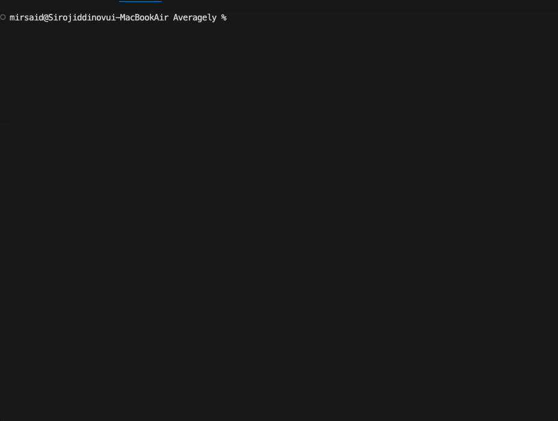

# Averagely

## Overview 

This is the fully ready project which can calculate the average and overall score of students.

Have a look at `Program.cs` file and you can see how i used:

 * Console input/output
 * Converting Data types
 * Calculation to find ***overall*** and ***average*** grades
 * ` Switch  ` statement ->

 Case 1 :

 

 Case 2 :

 

 ### Here are videos --> 

## Overall score

 

 ## Average score

## Non-stop part

[V3.0](https://github.com/Mirsaid04/Averagely/tree/releases/v3.0) `Program.cs` file appearance 

## Releases Note

V1.0

This [version/v1.0](https://github.com/Mirsaid04/Averagely/tree/releases/v1.0) was created to calculate basic parts of Average score and also it is being run only one time , i tried to fix it in my new version , let's check ...

V2.0 

This [version/v2.0](https://github.com/Mirsaid04/Averagely/tree/releases/v2.0) is ready to calculate average and overall score . I made this version as non-stop run, even if you  don't click "n", it never stops. Thank you

V3.0

This [version/v3.0](https://github.com/Mirsaid04/Averagely/tree/releases/v3.0) is new version , I hope you will learn about interfaces and classes very well . Thank you